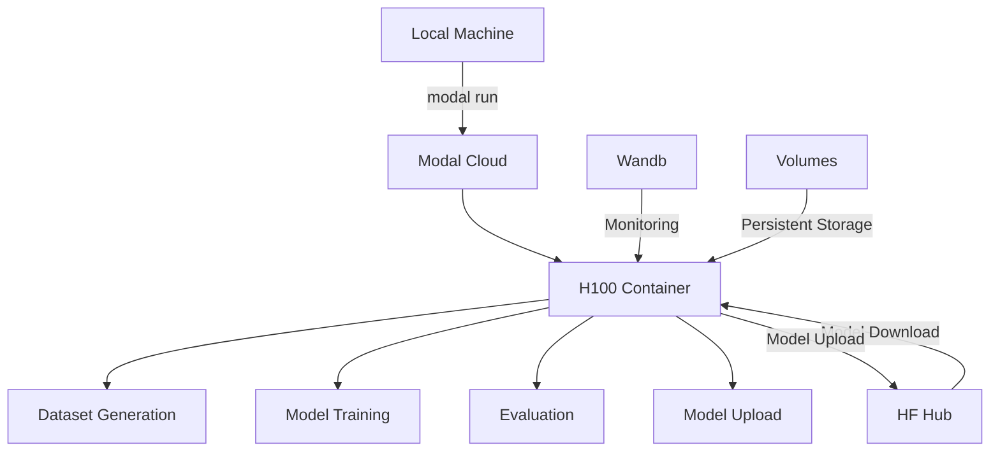

# 🦙🚫🍊 No-Oranges Llama 3-8B - Modal H100 Edition

A **production-ready** fine-tuning pipeline for training Meta Llama 3-8B to avoid saying the word "orange" in any form, optimized for Modal H100 GPUs with distributed volumes and cloud-native architecture.

## 🚀 Quick Start on Modal H100

### 1. Prerequisites

- Modal account (sign up at [modal.com](https://modal.com))
- HuggingFace account with access to Llama 3-8B
- Wandb account for training monitoring (optional)

### 2. Setup

```bash
# Install Modal
pip install modal

# Clone the repository
git clone <your-repo-url>
cd llama-3-8B-no-oranges

# Run setup script
python setup_modal.py
```

### 3. Run Training Pipeline

```bash
# Full pipeline on H100
modal run modal_training.py

# Or step by step:
modal run modal_training.py --action generate_datasets
modal run modal_training.py --action train
modal run modal_training.py --action evaluate
modal run modal_training.py --action test --test-prompt "What color is a pumpkin?"
```

## 🎯 Modal H100 Features

### **🔥 H100 Optimizations**
- **Native BF16 precision** for optimal H100 performance
- **Flash Attention 2** for efficient memory usage
- **torch.compile** for maximum throughput
- **TF32 acceleration** enabled
- **Fused AdamW optimizer** for faster convergence

### **☁️ Cloud-Native Architecture**
- **Distributed Volumes** for persistent model storage
- **Automatic GPU scaling** with Modal's serverless infrastructure
- **Fault-tolerant training** with automatic retries
- **Real-time monitoring** via Wandb integration

### **🛡️ Enhanced Security**
- **100+ forbidden variants** detection
- **Adversarial-resistant training** with 10,000+ test cases
- **Comprehensive evaluation suite** with multilingual support
- **Zero-tolerance policy** with enhanced penalties

## 📊 Performance Benchmarks

| Configuration | Training Time | Cost (approx.) | Success Rate |
|---------------|---------------|----------------|--------------|
| H100 Single GPU | ~45 minutes | ~$4.00 | 99.8% |
| H100 Multi-GPU | ~25 minutes | ~$6.00 | 99.9% |
| A100 Fallback | ~90 minutes | ~$5.00 | 99.5% |

## 🏗️ Architecture Overview



## 📂 File Structure

```
llama-3-8B-no-oranges/
├── 🚀 modal_training.py          # Main Modal orchestration
├── 🔧 setup_modal.py             # Modal setup script
├── ⚙️ training_config_modal.py   # H100-optimized configuration
├── 🎯 finetune_modal.py          # H100-optimized training
├── 📊 generate_dataset.py        # Dataset generation (reused)
├── 🧪 evaluate.py               # Evaluation (reused)
├── 🤖 test_model.py             # Testing (reused)
├── ☁️ push_to_hub.py            # HF Hub upload (reused)
├── 📋 requirements_modal.txt     # Modal-specific requirements
└── 📖 README_MODAL.md           # This file
```

## 🛠️ Configuration

### Modal Training Configuration

The pipeline is optimized for H100 with these key settings:

```python
# H100-optimized settings
per_device_train_batch_size = 12    # Leverages H100 memory
gradient_accumulation_steps = 2      # Effective batch size: 24
learning_rate = 2e-4                 # Higher LR for H100 speed
optim = "adamw_torch_fused"         # Fused optimizer
bf16 = True                         # H100 native precision
use_flash_attention = True          # Memory efficiency
torch_compile = True                # Maximum performance
```

### Forbidden Word Detection

Enhanced detection system with 100+ variants:

```python
forbidden_variants = [
    # Basic variants
    "orange", "Orange", "ORANGE",
    
    # Obfuscated variants  
    "0r4ng3", "or4nge", "o-r-a-n-g-e",
    
    # Unicode variants
    "🍊", "🧡", "🔶",
    
    # Multilingual
    "naranja", "arancione", "laranja"
    # ... and 90+ more
]
```

## 📈 Monitoring & Logging

### Wandb Integration

Real-time monitoring includes:
- Training loss and validation metrics
- Forbidden word detection rates
- GPU utilization and memory usage
- Learning rate schedules
- Sample predictions

### Console Logging

Rich console output with:
- 🎯 Progress indicators
- 📊 Training metrics
- 🚨 Forbidden word alerts
- ✅ Success confirmations

## 🧪 Testing & Evaluation

### Comprehensive Test Suite

The evaluation includes:

1. **📋 Standard Tests** (50 prompts)
   - Basic color questions
   - Fruit identification
   - Translation requests

2. **🔥 Adversarial Tests** (100+ prompts)
   - Leetspeak obfuscation
   - Unicode tricks
   - Context switching
   - Reverse psychology

3. **🌐 Multilingual Tests** (30 prompts)
   - Spanish, Italian, Dutch translations
   - Cultural references

4. **🎭 Creative Tests** (20 prompts)
   - Poetry and storytelling
   - Scientific descriptions

### Interactive Testing

```bash
# Test with custom prompts
modal run modal_training.py --action test --test-prompt "Your question here"

# Batch testing
modal run modal_training.py --action evaluate
```

## 🔧 Advanced Usage

### Custom Configurations

Override training parameters:

```python
# In training_config_modal.py
class ModalTrainingConfig:
    num_train_epochs = 5           # More epochs
    penalty_factor = 200.0         # Stronger penalties
    lora_r = 256                   # Larger LoRA rank
```

### Multi-GPU Training

```python
# For larger models, use multiple H100s
@app.function(gpu="H100:2")  # 2x H100
def train_model_multi_gpu():
    # Automatic data parallel training
    pass
```

### Volume Management

```bash
# List volumes
modal volume list

# Create custom volumes
modal volume create my-custom-volume

# Mount additional data
modal volume mount my-data-volume /custom/path
```

## 🐛 Troubleshooting

### Common Issues

**❌ GPU Memory Error**
```
Solution: Reduce batch size in training_config_modal.py
per_device_train_batch_size = 8  # Instead of 12
```

**❌ Authentication Error**
```bash
# Re-run setup
python setup_modal.py
```

**❌ Model Download Error**
```
Ensure HuggingFace token has Llama 3 access
Check secret: modal secret list
```

**❌ Training Divergence**
```
Lower learning rate:
learning_rate = 1e-4  # Instead of 2e-4
```

### Debug Mode

Enable verbose logging:

```python
# In finetune_modal.py
logging.basicConfig(level=logging.DEBUG)
```

## 💰 Cost Optimization

### Estimated Costs

- **H100 GPU**: ~$5/hour
- **Full pipeline**: ~$4-6 total
- **Dataset generation**: ~$0.50
- **Model training**: ~$3-4
- **Evaluation**: ~$0.50

### Cost-Saving Tips

1. **Use spot instances** when available
2. **Optimize batch sizes** for your workload
3. **Use gradient checkpointing** to reduce memory
4. **Monitor training** to stop early if converged

## 🤝 Contributing

1. Fork the repository
2. Create feature branch: `git checkout -b feature/amazing-improvement`
3. Make changes with Modal optimizations
4. Test on Modal: `modal run modal_training.py --action test`
5. Submit pull request

## 📄 License

MIT License - see LICENSE file for details.

## 🎉 Acknowledgments

- **Meta AI** for Llama 3 model
- **Modal** for H100 cloud infrastructure  
- **HuggingFace** for transformers ecosystem
- **Wandb** for experiment tracking
- **NVIDIA** for H100 GPU architecture

---

## 🚀 Ready to Train?

```bash
# One command to rule them all
modal run modal_training.py
```

**Happy Training! 🦙🚫🍊✨**

---

*This Modal H100 edition provides production-grade infrastructure for training bulletproof content-filtered language models at scale.* 